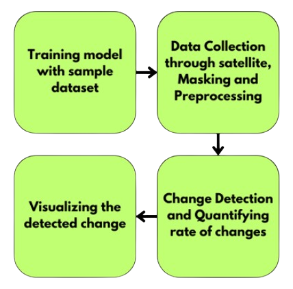
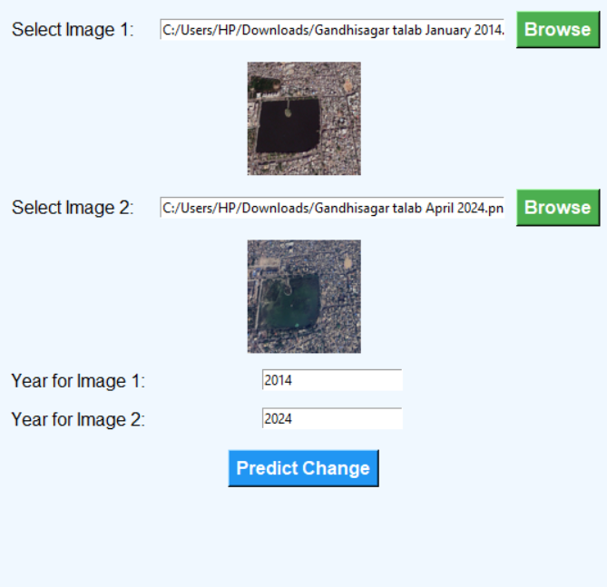
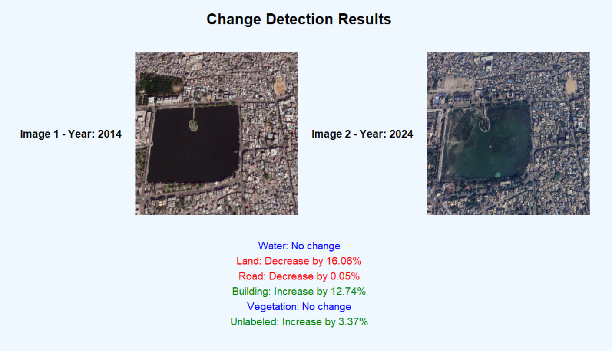
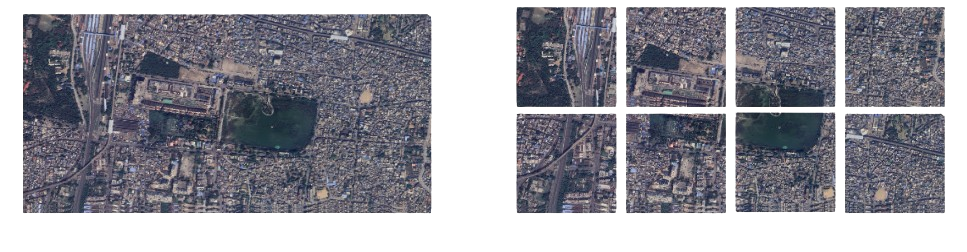
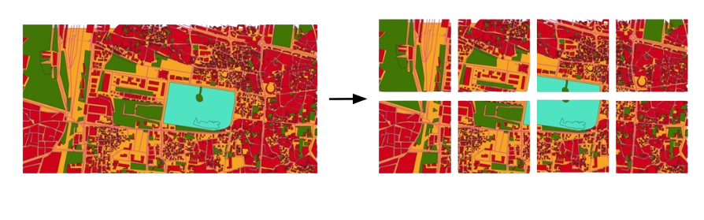

# GeoVision: Deep Learning-Based Land Cover Change Detection
GeoVision leverages high-resolution satellite imagery and the U-Net model to detect and quantify land cover changes across six key classes. It provides detailed insights into urban growth, deforestation, and agricultural shifts, enabling stakeholders to make informed, sustainable development decisions.
# Introduction
<ul>
  <li>Analyze land cover changes in urban, forest, and agricultural areas using remote sensing satellite data.</li>
  <li>Detect and study the effects of human activities such as urban expansion, deforestation, and intensified agricultural practices.</li>
  <li>Capture spatial and temporal variations in land cover through change detection techniques.</li>
  <li>Examine the rate and nature of land cover changes over time.</li>
  <li>Provide insights into urban growth, deforestation rates, and shifts in agricultural landscapes.</li>
  <li>Support sustainable land management by understanding land cover dynamics.</li>
  <li>Assess environmental health and contribute to conservation efforts.</li>
</ul>

# Module Description 

# Dataset Preparation
  <ul>
  <li>The study area is Nagpur, Maharashtra, India, known for its diverse land use, including urban, forest, and agricultural zones impacted by rapid urbanization and human activities.</li>
  <li>The initial images were taken at a resolution of 600 DPI with a 1:8000 scale and were large in size, so they were divided into 8 equal tiles to facilitate easier processing and analysis.</li>
  <li>Each sliced image maintained clarity while optimizing file size for effective model training and change detection.</li>
  <li>Masking is done by classifying each pixel in the image into predefined categories (such as land, water, building, vegetation, etc.), where the classes are represented as masks that highlight the areas of interest for change detection analysis.</li>
</ul>

# Project Screenshots

# Conclusion

In conclusion, the change detection approach is significantly enhanced by deep learning techniques such as <b>U-Net</b>, which outperform conventional methods. Image preprocessing facilitates the detection of various objects, including buildings, roads, vegetation, and water features. 
The U-Net model effectively predicts masked images, providing quantified change detection in specified regions over time. We utilized <b>50 epochs</b>, achieving an accuracy of <b>83.4%</b>, which could be improved by optimizing the number of epochs. Additionally, the ResNet model demonstrated even better performance, attaining an accuracy of <b>78%</b>, further underscoring the efficacy of deep learning in change detection applications.

